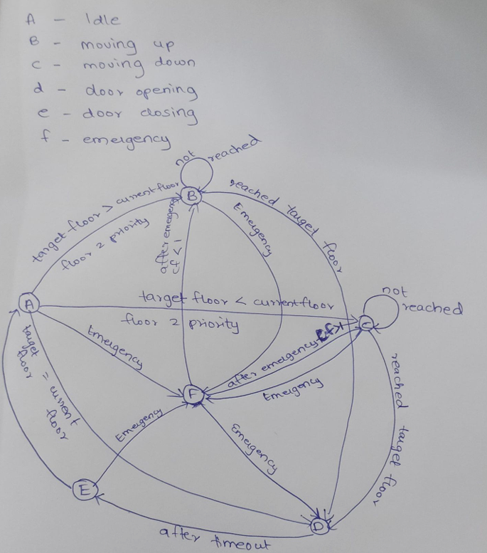
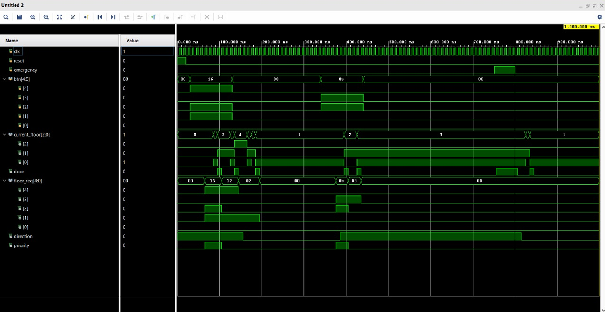

# Multi-Floor Elevator Controller Using FSM on FPGA

## Project Overview

This project implements a **5-floor elevator controller using a Finite State Machine (FSM) architecture on FPGA**.  
The system manages elevator movement, floor requests, door operations, and emergency handling using **Verilog HDL**.

The design includes **dynamic request handling**, **priority servicing for Floor 2**, and an **emergency override mechanism** that safely halts the elevator and returns it to a recovery floor before resuming normal operation.

This project was developed as part of a **Digital System Design Internship focused on FPGA-based system design**.

---

## Features

- 5-floor elevator control system
- **FSM-based control architecture**
- Floor request handling using push buttons
- **Priority servicing for Floor 2**
- **Emergency override mechanism**
- Door open and close timing control
- Direction tracking (**Up / Down**)
- Simulation verification using testbench
- FPGA hardware implementation

---

## FSM Design

The elevator controller operates using a **Finite State Machine with the following states**:

| State | Description |
|------|-------------|
| **IDLE** | Elevator waits for floor requests |
| **MOVING_UP** | Elevator moves upward toward the target floor |
| **MOVING_DOWN** | Elevator moves downward toward the target floor |
| **DOOR_OPENING** | Elevator door opens at the requested floor |
| **DOOR_CLOSING** | Door closes after a timeout |
| **EMERGENCY** | Elevator halts and enters emergency mode |

### FSM Diagram



---

## System Architecture

The system processes elevator requests through input buttons and determines the next action based on:

- Current floor
- Requested floors
- Priority logic
- Emergency input

The FSM controls:

- Elevator movement
- Door operations
- Request servicing
- Emergency recovery

The controller continuously evaluates incoming requests and determines the appropriate state transitions.

---

## Technologies Used

- **Verilog HDL**
- **Finite State Machine (FSM) Design**
- **FPGA Digital System Design**
- **Xilinx Vivado**
- **Artix-7 FPGA Development Board**
- **Simulation Waveform Analysis**

---

## Repository Structure

```
Multi-Floor-Elevator-FSM
│
├── elevator_controller.v
├── elevator_tb.v
├── fsm_diagram.png
├── simulation_waveform.png
├── fpga_board.png
└── README.md
```

---

## Simulation

The elevator controller was verified using a **Verilog testbench simulation**.

Simulation validated:

- Correct floor request servicing
- Elevator direction control
- Door open and close timing
- Priority handling for Floor 2
- Emergency condition handling and safe system recovery

### Simulation Waveform



---

## Hardware Implementation

The design was implemented and tested on an **Artix-7 FPGA development board using Vivado**.

The FPGA implementation demonstrated:

- Elevator movement between floors
- Correct door operation
- Request processing
- Emergency handling mechanism

### FPGA Implementation


---

## Author

**Parvathy S Nair**  
Electronics and Communication Engineering  
Digital System Design Internship Project
